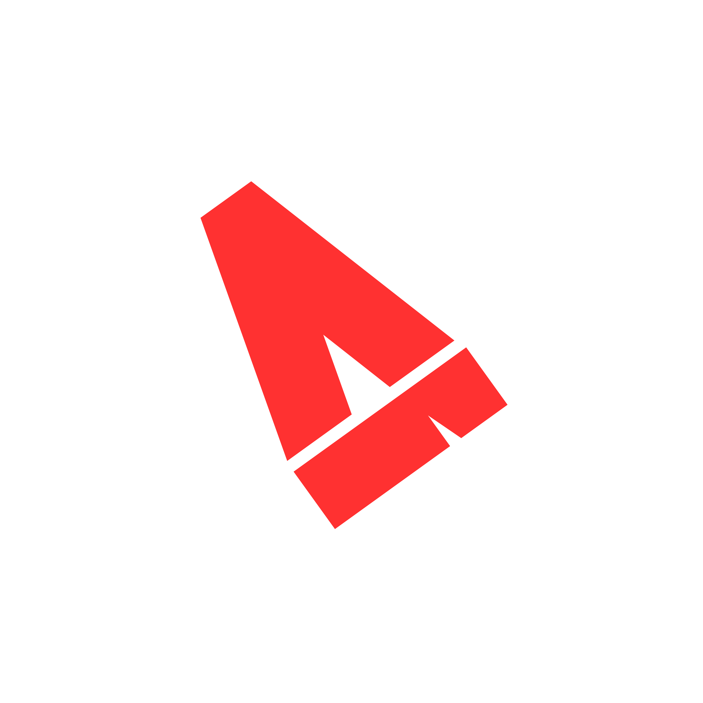

<div align="center">
  
</div>

<h1 align="center">invertkilo</h1>
<p align="center">
  <code>~01101011 01101001 01101100 01101111</code>
</p>

<p align="center">
  <i>NOT the average kilobyte.</i>
</p>

<br/>

<p align="center">
  one solo dev, flipping bits at scale.<br/>
  i invert assumptions, ship at 1000x, and break things on purpose<br/>
  so they come back together better.
</p>

<br/>

<div align="center">

```diff
- this is what most people build
+ this is what i build instead
```

</div>

<br/>

<p align="center">
  no team. no roadmap meetings. no permission.<br/>
  just code, caffeine, and the occasional 3am epiphany.
</p>

<br/>

<h3 align="center">⌁ find me ⌁</h3>

<p align="center">
  <a href="mailto:invertkilo@gmail.com">
    
  </a>
  <a href="https://instagram.com/invert.kilo">
    
  </a>
  <a href="https://github.com/invertkilo">
    
  </a>
</p>

<br/>

<div align="center">
  <sub>1 kilobyte = 1024 bytes. invert it, and it still adds up.</sub>
</div>
